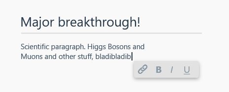

# Project 3 @cmda-minor-web · 2018-2019

For the third project in the Webdesign minor, I was tasked to make a WYSIWYG editor for MarkDown documents.

## Dag 1-2 (Ma-Di)

### Research
As a webdesigner in the making, I decided to immediately dive into researching the current situation. What works? What doesn't? Who uses the current program? Who will use the new program? Etc. Some of these questions were already answered at the end of the kick-off presentation, but some were yet to be answered. To create an _exclusive_ design for the scientists behind ALICE and CERN, ik shall adhere to the four principles of exculsive design, as defined by Vasilis van Gemert:

- Study situation
- Ignore conventions
- Prioritise identity
- Add nonsense

#### Study situation
The first question to be answered was _Where and how will the editor be used?_ Now the first part of that question wasn't hard to answer: the editor will be used mostly at CERN. But to answer _how_ the editor will be used I had to do a bit of digging around.

Let's look at the stats from the kick-off presentation:

- Electronic logbook
  - human and machine users
  - 5000 LHC fills, 280.000 runs
  - 37 GB data from 195.000 log entries
  - 20.000 file attachments

Aha! According to the presentation, the current logbook will be used by both humans and machines. This explains the need for a markup language: both humans and machines can easily parse and write in them. Also, it makes clear that there must be support for file attachments.

Furthermore, there seems to be a need for integration with a new 'tag system', and logs and comments should be in the form of threads (like Reddit, according to the current students working on the system):

- Database considerations
  - Being able to migrate old data to new scheme
  - Support for Tags
  - Support for Threads (comments)
  - All functionality from one application.

#### Ignore conventions
I must first have a look at the current state of WYSIWYG editors, and understand the conventions, in order to ignore them completely.

[According to Matt Doyle, most WYSIWYG editors let you do at least the following](https://www.elated.com/adding-wysiwyg-editor-to-your-site/):
- Add formatting such as bold, italic, and underlining
- Create headings
- Create links
- Use different font faces, sizes, and colours
- Insert bulleted and numbered lists
- Create tables
- Left-align, right-align, centre, and justify text
- Embed images, Flash movies, and more
- Edit the target language directly if desired

Allright! Now what to ignore...

##### Formatting
Formatting is definately a _must_. This is a convention for a reason, and even in this specific situation upholds its value.

##### Headings
Headings are also necessary, but in another way than every editor implements them. Normal WYSIWYG editors allow the user to insert headings all around, even if that destroys the semantic structure of a proper document. therefore, I have decided to allow only to insert headings in the following way:

- The first line of a document is _always_ a heading, and **must** be the largest heading (unless it's a comment, which requires no title).
- Subsequent headings can only be smaller, and cannot in- or decrement in size by more than one semantic step (i.e. h1>h2>h3, but not h1>h4>h2, etc.).
- To preserve semantic structure, the user is disallowed to alter the size of headings (or any text in general), because they are not to be styled.

This ensures that every document has a proper semantic structure.

##### Links
I'm not sure whether all kinds of links should be allowed in documents, but to be sure I will allow them. Maybe one comment can link to another comment. If only links on the current domain are allowed, it isn't the task of the editor to (dis)allow that anyway.

##### Font faces, colours, etc. (styling)
Almost every editor allows users to style their bits of text in any way they want. I'm not going to allow it. Firstly because it wreaks absolute havoc on the design and semantics of documents. This negatively alters the legibility and scannability of documents. Secondly, because it's in the interest of the author and CERN in its entirity to have people do as little work to properly log findings.

##### Lists
Lists sound like an important part of any document, therefore I will allow it.

##### Tables
Because of the scientific nature of all documents, there probably is a need for tables. I will allow them unless I later on find out it's not a good idea.

##### Aligning text
Aligning text is, in my opinion, part of document styling. I'm not allowing user styling of any kind, so there will be no align support.

##### Embedding
Logs themselves will not be allowed to directly contain embedded content (other than quotes/excerpts from other documents in textual form). They are however allowed to contain content such as images as attachments. This is not strictly part of the editor.

##### Edit target language
To facilitate the more technical authors (and administrators) at CERN, the editor must provide both "plaintext" and MarkDown helpers (such as auto-closing characters and keybinds).

##### Interface
The last (non-standard) part of ignoring conventions would be a study of the interface of an average WYSIWYG editor. [Most editors have a toolbar with which you can edit the style and semantics of a document](https://www.footsteps-design.co.uk/wp-content/uploads/2017/04/Why-The-WordPress-WYSIWYG-Editor-is-Awesome.jpg). I never thought this was the best solution anyway, and now is the perfect time to look for other ways!

I propose a completely different way of thinking about document editing. Most programmers see technical creations as a series of "organisms", built out of "atoms" and "molecules". This is just a delusional way to say that these systems are built with _components_. The way I see it, a document is also such a system. It contains several components, such as headings and paragraphs. These components are in charge of their own behaviour and looks. This made me think: _What if every heading and paragraph has its own controls?_ A heading allows a user to in- or decrease its semantic size (h1>h2 or h2>h1), a paragraph/sentence allows the user to transform it into a link, and vice versa. To build upon this idea, I will have a "hovering" toolbar that sits near the content the user is currently editing:

#### Prioritise identity
AHH

#### Add nonsense
AHH

### Components
Mithriljs components research enzo